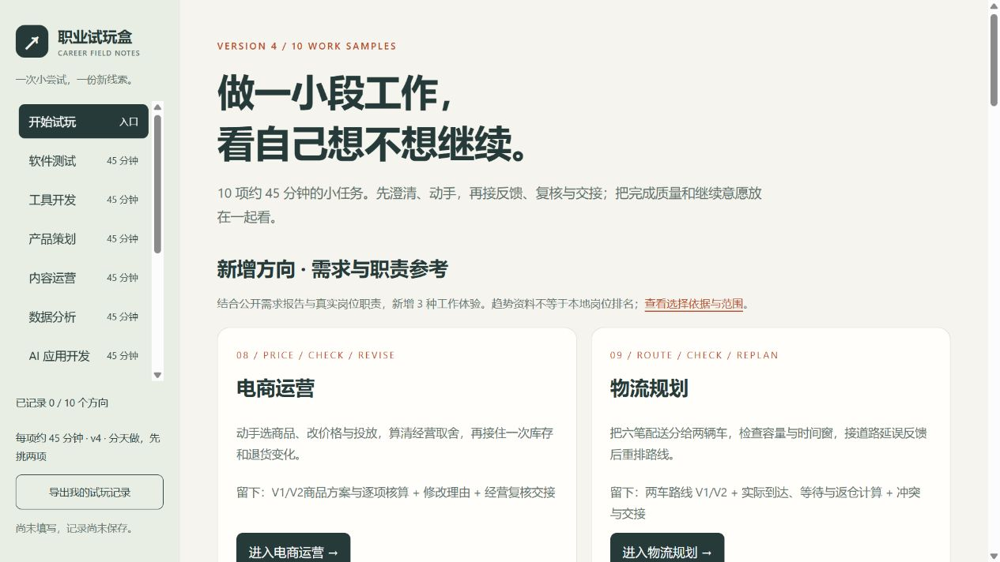

# 职业试玩盒 · Career Field Notes

用七个约 45 分钟的工作样本，了解自己愿不愿意继续探索一个方向。每次从一份任务说明开始，动手做出成果，再接收模拟反馈、复核并交接。先挑最感兴趣的两项，分天尝试即可。

[在线试玩](https://rui399648-png.github.io/career-field-notes/) · [下载完整项目](https://github.com/rui399648-png/career-field-notes/archive/refs/heads/main.zip)



## 七个方向

| 方向 | 这次会做什么 |
| --- | --- |
| 数据分析 | 清洗活动日志，计算指标，回应「当前有效报名」口径变化 |
| AI 应用开发 | 修改离线知识问答规则，查看检索证据，重跑样例并检查回归 |
| 安全分析 | 分流模拟告警，建立时间线，补充证据并写交接 |
| 软件测试 | 设计重点用例，复现问题，验证修复候选页并做回归 |
| 工具开发 | 补全两个 Python 函数，跑验收，处理容量规则变化 |
| 产品策划 | 在有限预算内取舍，回应反馈，写验收标准和指标口径 |
| 内容运营 | 制作两种渠道稿件，核对事实，修改并做有限复盘 |

每轮包含 5 / 15 / 15 / 10 分钟四阶段，最后 5 分钟记录具体经历与继续意愿。部分方向提供另计时间的可选加做。

## 开始试玩

下载仓库 ZIP 并完整解压，用 Edge 或 Chrome 打开根目录的 `index.html`。也可以在仓库目录运行：

```sh
python -m http.server 8767 --bind 127.0.0.1
```

然后打开 <http://localhost:8767/>。网页使用原生 HTML、CSS 和 JavaScript，离线可用，无需账号或安装 npm 依赖。

工具开发主轮需要 Python 3.10+，进入 `materials` 目录后修改 `starter.py`，运行 `python check_tool.py`。练习起始版本未完成，初次检查失败属于题目设计；参考实现见 `tool-reference.py`。其余主轮可在浏览器和文本编辑器中完成。

## 记录与隐私

答案、勾选与计时保存在当前浏览器的本地存储中。侧栏显示保存结果；在「体验对照」导出 Markdown 记录与 JSON 备份。网页没有分析埋点，也不自动上传填写内容。外部岗位来源链接会打开对应网站。

换域名、换浏览器、直接打开文件或清理浏览器数据时，记录可能无法沿用；切换前先导出 JSON。同一份记录建议在一个标签页编辑，冲突时先导出本页内容再刷新。v3 沿用 v2 数据格式，v1 记录只读归档；导入备份只补空字段，保留已有答案。

AI 工作台使用可编辑的确定性检索规则与模拟知识卡，未调用大模型。工作台里的 V1 / V2 试验记录只留在当前页面内存中，需要复制或下载后再关闭。

## 材料与依据

- [开始使用](开始使用.md)：操作、保存、版本迁移与计时说明。
- [试玩手册](试玩手册.md)：七个完整工作样本。
- [岗位参考与任务映射](岗位参考与任务映射.md)：真实岗位职责如何缩小成练习。
- [新增岗位与依据](新增岗位与依据.md)：数据、AI、安全方向的趋势来源与适用边界。
- [审查与改进](审查与改进.md)：v1 → v3 的复审、修复和验证记录。

所有活动、人物、工时、数据、知识卡、日志和反馈均为模拟。公开岗位材料只用于参考工作活动；这些短练习不等同于完整岗位工作，也不提供职业适合度评分。`signup-demo.html` 的缺陷和 `starter.py` 的空实现为教学设计保留。

## 开发验证

使用 Node.js 18+，在仓库根目录执行：

```sh
npm test
```

测试使用 Node 标准库，不需要 `npm install`。验证覆盖记录保存与冲突保护、导入兼容、AI 检索与交互、数据指标重算、安全材料一致性和本地资源链接。

## GitHub Pages

本项目可从 `main` 分支的根目录直接发布。配置步骤见 [发布说明](docs/github-pages.md)。根目录的 `.nojekyll` 文件用于直接发布静态资源。
